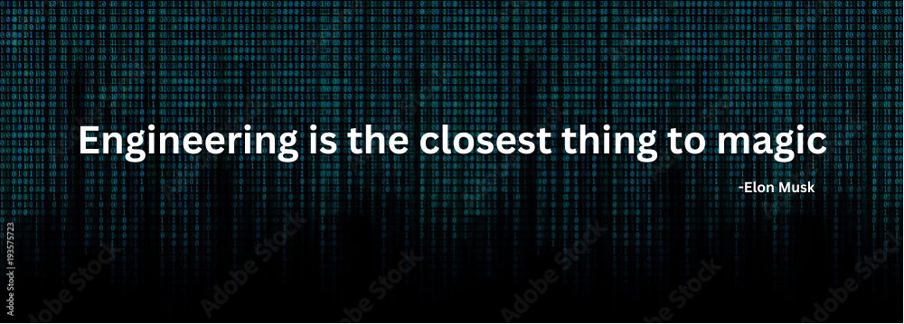

  

<h1 align="center">
  Hey there, I'm Harsh Jain
  
</h1>

  

 

### 🔥 What Drives Me

I'm a **B.Tech IT student at DJSCE Mumbai** and an **AI Engineer at COCO**, building agentic AI systems that actually work in production. I live in Python and C++, compete on CodeChef (3★) and Codeforces, and have a serious habit of shipping fast — **13 national hackathons** and counting.

I turn messy, real-world problems into clean systems. If it involves LLMs, multi-agent orchestration, Graph RAG, or competitive programming at 2 AM, I'm in.

- 🌱 Deep-diving into **Graph RAG, MCP tool-calling, and efficient agent memory**
- 🔭 Building an **Agentic English Tutor** with real-time STT/TTS and adaptive dialogue
- ⚡ Previously **Founding Engineer @ Nextheta** — voice-enabled multi-agent systems
- 💬 Ask me about: LangChain, FastAPI, ZeroMQ, CP strategies, or why Python > everything
- ⚡ Fun fact: The best code is always written 3 hours before the deadline

---

### 🛠️ Tech Stack

**Languages**

  

**AI / ML / Agents**

  

**Backend & Frameworks**

  

**Databases**

  

**Cloud & DevOps**

  

**Tools**

  

---

### 📊 GitHub Stats

  
  

  

  

---

  Built with obsession. Deployed with purpose.

